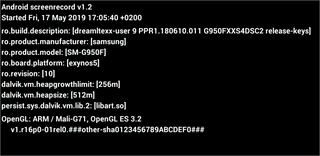

 
# FastExoPlayerSeeker          

## Introduction

Adds fast seeking for exoplayer. (Note: it also depends on the amount of video encoding, mainly IDR Frames)

## How to install

    repositories {
        maven {
            url "https://jitpack.io"
        }
    }

    dependencies {
        implementation 'com.github.kibotu:FastExoPlayerSeeker:-SNAPSHOT'
    }

## How to use

### Create Emitter

    val emitter = SeekPositionEmitter()
    emitter.seekFast(newSeekPosition)

### Create Observable

    simpleExoPlayer.seekWhenReady(emitter)
        .subscribe({
            logv("seekTo=${it.first} isSeeking=${it.second}")
        }, { loge("${it.message}") })
        .addTo(subscriptions) // don't forget to dispose when you're done!

### FFMpeg

I've had good results increasing the amount if IDR frames using the following script which in term will help exoplayer snap to those sync frames and improve scrubbing.

    #!/usr/bin/env bash
    # change iframe rate
    # https://gist.github.com/kibotu/27c5d665d19b9f782e6b4f26eff878b1
    #
    # https://ffmpeg.org/ffmpeg-formats.html#mov_002c-mp4_002c-ismv
    # -movflags faststart
    #  Run a second pass moving the index (moov atom) to the beginning of the file. This operation can take a while, and will not work in various situations such as fragmented output, thus it is not enabled by default.
    #
    # -movflags rtphint
    #  Add RTP hinting tracks to the output file.
    #
    # -c:v libx264
    # -c codec codec name
    #
    # -profile profile set profile
    # Another optional setting is -profile:v which will limit the output to a specific H.264 profile.
    # Omit this unless your target device only supports a certain profile (see Compatibility).
    # Current profiles include: baseline, main, high, high10, high422, high444. Note that usage of -profile:v is incompatible with lossless encoding.
    # https://trac.ffmpeg.org/wiki/Encode/H.264
    # https://trac.ffmpeg.org/wiki/Encode/H.264#Compatibility
    #
    #  -keyint_min E..V…. minimum interval between IDR-frames (from INT_MIN to INT_MAX) (default 25)
    ffmpeg -i inputvide.mp4 -c:v libx264 -profile:v baseline -level 3.0 -x264opts keyint=10:min-keyint=10 -g 10 -movflags +faststart+rtphint -maxrate:v 4000k -bufsize:v 4500k outputvideo.mp4

## How to build

    graldew clean build

### CI

    gradlew clean assembleRelease test javadoc

#### Build Requirements

- JDK8
- Android Build Tools 28.0.3
- Android SDK 28

## Contributors

- [Jan Rabe](jan.rabe@kibotu.net)

### License

<pre>
Copyright 2019 Jan Rabe

Licensed under the Apache License, Version 2.0 (the "License");
you may not use this file except in compliance with the License.
You may obtain a copy of the License at

   http://www.apache.org/licenses/LICENSE-2.0

Unless required by applicable law or agreed to in writing, software
distributed under the License is distributed on an "AS IS" BASIS,
WITHOUT WARRANTIES OR CONDITIONS OF ANY KIND, either express or implied.
See the License for the specific language governing permissions and
limitations under the License.
</pre>
